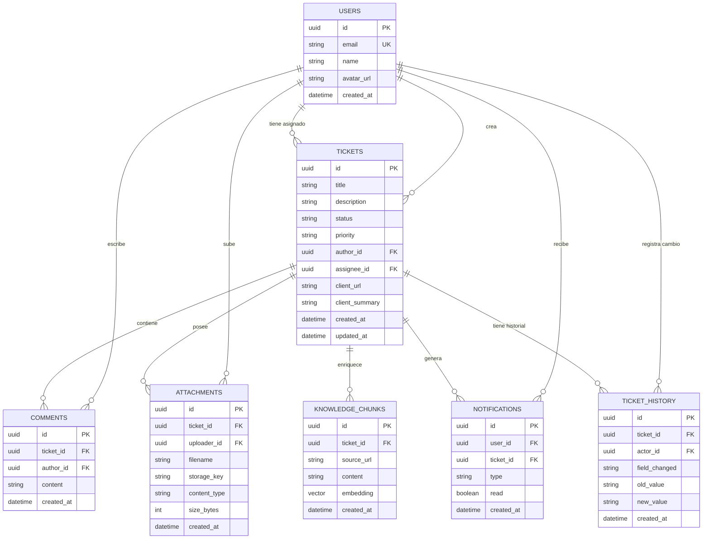
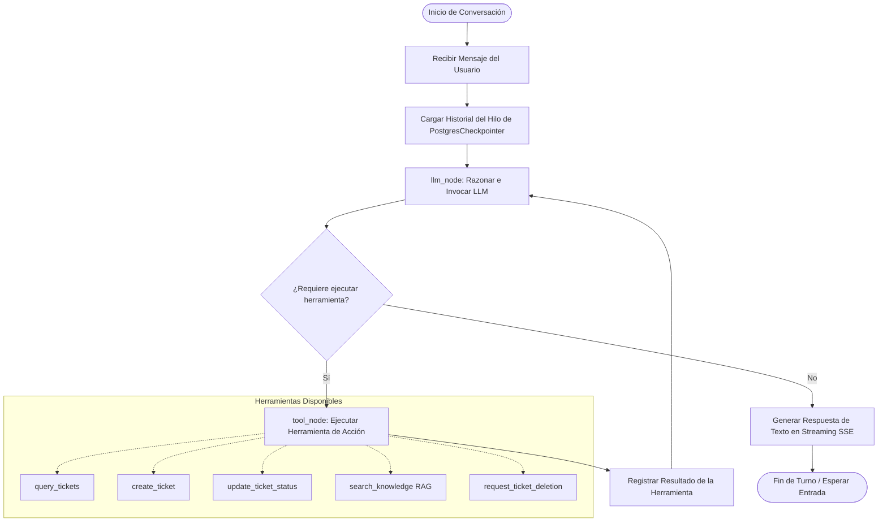

# D4-Ticket AI
## Plataforma Inteligente de Gestión de Incidencias mediante Agentes de Inteligencia Artificial

---

**Título del proyecto:** D4-Ticket AI: Plataforma avanzada de gestión de incidencias con Agentes de IA, Búsqueda Híbrida y Motor de Diagnóstico AI Co-pilot

**Alumno:** Eudaldo Álvaro Cal Saúl

**Módulo profesional:** Proyecto Intermodular — Ciclo Superior en Desarrollo de Aplicaciones Web (DAW)

**Profesor responsable:** Óliver Díaz Rodríguez

**Fecha de entrega:** Mayo de 2026

---

## Índice

1. [Introducción](#1-introducción)
2. [Relación con el anteproyecto](#2-relación-con-el-anteproyecto)
3. [Objetivos del proyecto](#3-objetivos-del-proyecto)
4. [Diseño del sistema y solución propuesta](#4-diseño-del-sistema-y-solución-propuesta)
   - 4.1 Arquitectura general
   - 4.2 Modelo de datos
   - 4.3 Diseño de la API REST
   - 4.4 Diseño del agente de IA
5. [Desarrollo e implementación](#5-desarrollo-e-implementación)
   - 5.1 Backend — FastAPI
   - 5.2 Frontend — Next.js
   - 5.3 Capa de inteligencia — LangGraph + RAG
   - 5.4 Comunicación en tiempo real
   - 5.5 Almacenamiento de adjuntos
   - 5.6 Autenticación
   - 5.7 Despliegue
6. [Pruebas y validación](#6-pruebas-y-validación)
   - 6.1 Pruebas del backend (pytest)
   - 6.2 Pruebas del frontend (Vitest)
   - 6.3 Pruebas de tipado y calidad de código
   - 6.4 Pruebas E2E con Playwright
   - 6.5 Validación funcional manual
   - 6.6 Evidencias
7. [Problemas encontrados y soluciones adoptadas](#7-problemas-encontrados-y-soluciones-adoptadas)
8. [Resultados finales](#8-resultados-finales)
9. [Conclusiones](#9-conclusiones)
10. [Bibliografía y fuentes](#10-bibliografía-y-fuentes)
11. [Anexos](#11-anexos)

---

## 1. Introducción

### 1.1 Contextualización del trabajo

En el sector de las Tecnologías de la Información y la Comunicación, la gestión eficiente de incidencias es un pilar fundamental para garantizar la continuidad operativa de cualquier organización. Los sistemas de ticketing tradicionales, ampliamente extendidos en equipos técnicos, presentan sin embargo limitaciones considerables: procesos manuales repetitivos, búsquedas por palabras clave poco precisas y una escasa integración con el conocimiento acumulado por el equipo.

En los últimos años, la aparición de modelos de lenguaje de gran tamaño (LLM) y las arquitecturas de recuperación aumentada (RAG) han abierto una nueva categoría de herramientas capaces de comprender el contexto de una incidencia, sugerir diagnósticos y operar sobre el sistema mediante lenguaje natural. Este proyecto explora la aplicación práctica de dichas tecnologías sobre un caso de uso real.

### 1.2 Descripción global del proyecto

D4-Ticket AI es una aplicación web full-stack de gestión colaborativa de incidencias técnicas que integra un asistente conversacional de inteligencia artificial. Permite a los equipos crear, gestionar y resolver tickets desde un panel Kanban con actualización en tiempo real, y proporciona un agente de IA capaz de responder preguntas, buscar incidencias relacionadas y ejecutar acciones sobre el sistema mediante lenguaje natural.

La solución se articula en tres capas diferenciadas:

- **Frontend:** Next.js 16 con React 19, TypeScript y Tailwind CSS.
- **Backend:** FastAPI (Python) con PostgreSQL 16 y SQLAlchemy 2.
- **Capa de inteligencia:** LangGraph que orquesta un agente ReAct con Tool Calling, búsqueda híbrida vectorial y memoria persistente de conversaciones.

El proyecto nació de un reto técnico real planteado por la empresa Orbidi, lo que le otorga una dimensión profesional directa y verificable, con una instancia desplegada en producción y accesible públicamente.

### 1.3 Objetivo principal

Desarrollar una plataforma web de gestión de incidencias que integre un agente de IA conversacional y un motor de diagnóstico autónomo, capaz de automatizar flujos de trabajo repetitivos y optimizar la resolución técnica, conectando las competencias adquiridas a lo largo del ciclo DAW con las demandas reales del mercado laboral.

---

## 2. Relación con el anteproyecto

### 2.1 Síntesis del anteproyecto inicial

El anteproyecto definió D4-Ticket AI como una plataforma avanzada de gestión de incidencias con tres ejes técnicos principales:

1. Un sistema CRUD completo de tickets con panel Kanban en tiempo real y autenticación mediante Google OAuth 2.0.
2. Un agente de IA conversacional construido con LangGraph siguiendo el patrón ReAct, con herramientas de consulta y modificación del sistema.
3. Una capa de búsqueda híbrida que combina vectores semánticos (pgvector + Gemini embeddings) con búsqueda léxica, fusionados mediante el algoritmo Reciprocal Rank Fusion (RRF).

El stack tecnológico previsto era: Next.js 15, FastAPI, PostgreSQL 16, Redis, Docker, Railway y Vercel. La metodología planteada era iterativa e incremental, con cinco fases: análisis de requisitos, diseño del sistema, implementación, pruebas y despliegue.

### 2.2 Modificaciones realizadas durante el desarrollo

| Aspecto | Anteproyecto | Implementación final |
|---|---|---|
| Versión de Next.js | 15 | 16 (con React 19) |
| Versión de Node.js | 20 | 22+ |
| Confirmación de acciones IA sensibles | `interrupt/resume` persistente del grafo | Confirmación en frontend (human-in-the-loop ligero) |
| RAG — fuentes de conocimiento | Indexación de URLs externas | URLs externas + Archivos adjuntos (PDFs, especificaciones) |
| Identificador visible de ticket | Fragmento de UUID | Contador secuencial (#N) |

### 2.3 Justificación de los cambios

**Actualización a Next.js 16 / React 19:** La versión 16 se publicó durante el desarrollo e incorporaba mejoras de estabilidad en el App Router relevantes para este proyecto. Al no existir breaking changes críticos respecto a la versión 15, la actualización se realizó antes de avanzar en el frontend para beneficiarse de las mejoras desde el inicio.

**Confirmación de acciones en frontend:** La implementación del mecanismo `interrupt/resume` nativo de LangGraph requiere guardar en base de datos estados persistentes de hilos en pausa, introduciendo una complejidad de infraestructura propensa a problemas de sincronización si el usuario cancela la acción. En su lugar, se diseñó un **mecanismo de interrupción ligera por interceptación de eventos en streaming (SSE)**: la herramienta de borrado del agente emite una señal estructurada (`__DELETE_REQUESTED__`), la capa de streaming del backend la intercepta y emite un evento `confirmation_required` al cliente, y el frontend despliega un modal interactivo nativo (`ConfirmDialog`). Si el usuario confirma, la acción se ejecuta directamente mediante llamadas REST tradicionales. Esto garantiza el principio de **Human-in-the-Loop** de forma robusta y sin sobrecarga en el servidor.

**RAG con adjuntos de ticket:** El anteproyecto planteaba la base de conocimiento como una fuente documental externa limitada. Durante el desarrollo, se identificó que los adjuntos subidos directamente a cada ticket (PDFs, documentos de especificación, capturas de error, etc.) constituyen una fuente de conocimiento técnico de altísimo valor. Se diseñó e implementó con éxito un pipeline asíncrono que extrae el texto de estos archivos, lo fragmenta de manera semántica, genera embeddings utilizando `gemini-embedding-2` y almacena los vectores en `pgvector`. Esto permite al agente de IA resolver incidencias consultando la documentación técnica adjunta de manera instantánea y contextual, completando esta funcionalidad al 100%.

**Identificador de ticket (Contador Secuencial #N en lugar de fragmentos UUID):** Durante las fases iniciales del desarrollo, se optó por exponer un fragmento del UUID como identificador visual rápido para el usuario, dado que el sistema ya generaba estos IDs de forma única y nativa, simplificando así la lógica inicial del backend al no requerir gestión compleja de concurrencia. No obstante, de cara a la experiencia de usuario (UX) y siguiendo los estándares de diseño de plataformas profesionales de ticketing (como Jira o GitHub Issues), se decidió realizar una evolución técnica hacia un **contador secuencial entero e incremental (`#N`)**. Esta transición requirió la creación de una secuencia nativa en PostgreSQL (`ticket_number_seq`) y una migración segura de Alembic para el rellenado (*backfill*) indexado de los tickets preexistentes. El resultado final ofrece una interfaz mucho más limpia, intuitiva y visual, manteniendo la compatibilidad hacia atrás mediante una función inteligente de resolución híbrida (`resolve_ticket`).

---

## 3. Objetivos del proyecto

### 3.1 Objetivo general

Desarrollar una plataforma web de gestión de incidencias que integre un agente de IA conversacional y un motor de diagnóstico autónomo para automatizar flujos de trabajo y optimizar la resolución técnica.

### 3.2 Objetivos específicos y grado de cumplimiento

| # | Objetivo específico | Estado | Observaciones |
|---|---|---|---|
| 1 | Implementar autenticación segura mediante Google OAuth 2.0 y JWT | ✅ Completado | OAuth 2.0 con registro automático, cookies HttpOnly, JWT firmado HS256. |
| 2 | Desarrollar el módulo CRUD completo de tickets con filtros, ordenación y paginación | ✅ Completado | Filtros por estado, prioridad y asignado; ordenación multi-campo; paginación cursor-based. |
| 3 | Construir panel Kanban interactivo con actualizaciones en tiempo real | ✅ Completado | Drag & drop con reflejo inmediato en DB; sincronización vía WebSocket. |
| 4 | Integrar agente de IA (LangGraph ReAct) con Tool Calling sobre la BD | ✅ Completado | 10 herramientas disponibles; el agente reutiliza los servicios de la API. |
| 5 | Implementar búsqueda híbrida avanzada (vectores + texto) | ✅ Completado | pgvector con embeddings Gemini-embedding-2 + full-text search fusionados por RRF. |
| 6 | Desarrollar sistema de notificaciones en tiempo real | ✅ Completado | WebSocket + Redis Pub/Sub; fallback a PostgreSQL NOTIFY; badge de no leídas. |
| 7 | Desplegar en infraestructura cloud con CI/CD | ✅ Completado | Frontend en Vercel, backend y base de datos en Railway, storage en Cloudflare R2. |

Todos los objetivos específicos definidos en el anteproyecto han sido alcanzados satisfactoriamente. La única desviación significativa respecto al alcance previsto es la confirmación de acciones sensibles del agente IA, resuelta con un enfoque alternativo igualmente funcional (véase sección 2.3).

---

## 4. Diseño del sistema y solución propuesta

### 4.1 Arquitectura general

El sistema sigue una arquitectura de tres capas desacopladas que se comunican mediante interfaces bien definidas:

```
┌─────────────────────────────────────────┐
│           CLIENTE (Browser)             │
│  Next.js 16 · React 19 · Tailwind CSS   │
│  Zustand (estado global)                │
│  WebSocket (eventos en tiempo real)     │
└────────────────────┬────────────────────┘
                     │ HTTP/REST + WebSocket
┌────────────────────▼────────────────────┐
│         BACKEND (FastAPI)               │
│  Routers: tickets, comments,            │
│  attachments, notifications, auth, ai   │
│  Servicios de dominio                   │
│  Alembic (migraciones)                  │
└──────┬──────────┬──────────┬────────────┘
       │          │          │
┌──────▼──┐  ┌────▼────┐  ┌──▼────────────┐
│PostgreSQL│  │  Redis  │  │ MinIO / R2    │
│+ pgvector│  │ Pub/Sub │  │ (adjuntos S3) │
└──────────┘  └─────────┘  └───────────────┘
                     │
┌────────────────────▼────────────────────┐
│         CAPA DE IA (LangGraph)          │
│  Agente ReAct · Tool Calling            │
│  Gemini 2.5 Flash (principal)           │
│  GPT-4o-mini (fallback)                 │
│  RAG: knowledge_chunks + pgvector       │
└─────────────────────────────────────────┘
```

**Despliegue en producción:**

```
Vercel (frontend) ──► Railway (backend FastAPI + PostgreSQL) 
                 └──► Cloudflare R2 (storage de adjuntos)
                 └──► Google AI Studio (embeddings + Gemini)
                 └──► OpenAI API (fallback del agente)
```

A continuación se detalla el flujo y acoplamiento de la arquitectura de la solución mediante un diagrama de componentes:


```mermaid
graph TD
    subgraph Capa de Presentación (Frontend)
        Client[Navegador del Usuario]
        NextJS[Next.js 16 / React 19]
        Zustand[Zustand - Estado Global]
        WS_Client[useWebSocket - Cliente WS]
    end

    subgraph Capa de Negocio (Backend)
        FastAPI[FastAPI Web Server]
        Routers[Routers: Tickets, Comments, Auth, AI, WS]
        Services[Servicios de Dominio]
        LangGraph[LangGraph Agent Engine]
    end

    subgraph Capa de Persistencia e Infraestructura
        Postgres[(PostgreSQL 16 + pgvector)]
        Redis[(Redis Pub/Sub)]
        Cloudflare[(Cloudflare R2 S3)]
    end

    subgraph Proveedores de Inteligencia Artificial
        GoogleAI[Google AI Studio: Gemini 2.5 Flash]
        OpenAI[OpenAI API: GPT-4o-mini]
    end

    Client -->|Interacción de Usuario| NextJS
    NextJS -->|Gestión de Estado| Zustand
    NextJS -->|HTTP REST Requests| Routers
    WS_Client <-->|WebSocket Bidireccional| Routers

    Routers -->|Invocar Lógica| Services
    Services -->|Operaciones DB / RAG| Postgres
    Services -->|Sincronización Tiempo Real| Redis
    Services -->|Subida / Descarga de Adjuntos| Cloudflare
    Services -->|Orquestar Conversación| LangGraph

    LangGraph -->|Búsqueda Semántica Vectorial| Postgres
    LangGraph -->|Modelo Principal (Failover)| OpenAI
    LangGraph -->|Modelo Respaldo (Failover)| GoogleAI
```

### 4.2 Modelo de datos

El esquema de base de datos se gestiona íntegramente con migraciones Alembic y se compone de las siguientes entidades principales:

**Entidades y relaciones:**

```
users
  id (UUID, PK)
  email (único)
  name
  avatar_url
  created_at

tickets
  id (UUID, PK)
  title
  description
  status (open | in_progress | in_review | closed)
  priority (low | medium | high | critical)
  author_id (FK → users)
  assignee_id (FK → users, nullable)
  client_url (nullable)
  client_summary (nullable)
  created_at
  updated_at

comments
  id (UUID, PK)
  ticket_id (FK → tickets)
  author_id (FK → users)
  content
  created_at

attachments
  id (UUID, PK)
  ticket_id (FK → tickets)
  uploader_id (FK → users)
  filename
  storage_key
  content_type
  size_bytes
  created_at

notifications
  id (UUID, PK)
  user_id (FK → users)
  ticket_id (FK → tickets)
  type (assigned | commented | status_changed | deletion_requested)
  read (bool)
  created_at

ticket_history
  id (UUID, PK)
  ticket_id (FK → tickets)
  actor_id (FK → users)
  field_changed
  old_value
  new_value
  created_at

knowledge_chunks
  id (UUID, PK)
  ticket_id (FK → tickets, nullable)
  source_url (nullable)
  content (text)
  embedding (vector(768))   -- pgvector
  created_at
```

La extensión `pgvector` permite almacenar y consultar vectores de 768 dimensiones directamente en PostgreSQL, lo que simplifica la arquitectura al no requerir una base de datos vectorial separada (como Pinecone o Weaviate).

El siguiente diagrama de entidad-relación (ERD) representa de forma gráfica las tablas físicas del esquema, sus campos clave, tipos de datos y relaciones de cardinalidad:



### 4.3 Diseño de la API REST

La API sigue los principios REST y está documentada automáticamente mediante OpenAPI (Swagger). Se organiza bajo el prefijo `/api/v1/` con los siguientes routers:

| Router | Prefijo | Responsabilidad |
|---|---|---|
| Auth | `/auth` | Login OAuth, logout, perfil de usuario |
| Tickets | `/tickets` | CRUD, filtros, búsqueda híbrida |
| Comments | `/tickets/{id}/comments` | Comentarios por ticket |
| Attachments | `/tickets/{id}/attachments` | Subida, listado, descarga, eliminación |
| Notifications | `/notifications` | Listado, marcar leídas, eliminar |
| AI | `/ai` | Chat streaming (SSE), diagnóstico de ticket |
| WebSocket | `/ws` | Canal tiempo real por usuario |

Todas las rutas protegidas requieren un JWT válido en cookie `access_token`. La validación se centraliza en una dependencia FastAPI reutilizable (`get_current_user`).

### 4.4 Diseño del agente de IA

El agente sigue el patrón **ReAct** (Reasoning + Acting): en cada turno razona sobre qué herramienta utilizar, la ejecuta y observa el resultado antes de decidir el siguiente paso. Esto permite encadenar múltiples acciones en respuesta a una sola instrucción del usuario.

**Herramientas disponibles:**

| Herramienta | Acción |
|---|---|
| `query_tickets` | Consulta tickets con filtros combinables |
| `create_ticket` | Crea un ticket nuevo |
| `update_ticket_status` | Cambia el estado de un ticket |
| `add_comment` | Añade un comentario |
| `reassign_ticket` | Reasigna a otro usuario |
| `update_ticket` | Modifica campos del ticket |
| `get_ticket_history` | Consulta el historial de cambios |
| `search_users` | Busca usuarios por nombre para asistir en reasignaciones |
| `request_ticket_deletion` | Solicita borrado (requiere confirmación; solo autor puede borrar) |
| `search_knowledge` | Búsqueda RAG sobre la base de conocimiento |

La memoria de conversación se persiste en PostgreSQL mediante el checkpointer de LangGraph, lo que permite que el agente recuerde el contexto de intercambios anteriores incluso tras reinicios del servidor.

---

## 5. Desarrollo e implementación

### 5.1 Backend — FastAPI

#### Estructura del proyecto

```
backend/
├── app/
│   ├── main.py              # Punto de entrada, configuración CORS, registro de routers
│   ├── core/                # Configuración, seguridad, dependencias compartidas
│   ├── models/              # Modelos SQLAlchemy (ORM)
│   ├── schemas/             # Esquemas Pydantic (validación entrada/salida)
│   ├── services/            # Lógica de dominio desacoplada de los routers
│   ├── api/                 # Routers FastAPI
│   └── ai/                  # Agente LangGraph, herramientas, servicio de embeddings
├── migrations/              # Revisiones Alembic
└── tests/                   # Suite de pruebas pytest
```

La separación entre routers y servicios es una decisión deliberada para mantener los routers finos: solo validan la entrada, llaman al servicio correspondiente y devuelven la respuesta. Toda la lógica de negocio reside en los servicios, lo que facilita las pruebas unitarias y la reutilización desde el agente de IA.

#### Decisiones técnicas relevantes

**SQLAlchemy 2 + async:** Se utilizan sesiones asíncronas (`AsyncSession`) para no bloquear el event loop de FastAPI durante las operaciones de base de datos. Esto es especialmente importante en el endpoint de chat, donde el streaming SSE mantiene la conexión abierta durante varios segundos.

**Migraciones con Alembic:** Cada cambio de esquema genera una revisión de migración. El backend ejecuta `alembic upgrade head` automáticamente al arrancar en Docker, garantizando que el esquema de producción está siempre actualizado sin intervención manual.

**Preservación del historial en borrado:** Cuando se elimina un ticket, los comentarios y el historial de actividad se conservan en base de datos (soft-delete referencial), de modo que el agente puede responder preguntas sobre tickets ya cerrados.

#### Fragmento representativo: búsqueda híbrida

El endpoint de búsqueda combina dos señales independientes y las fusiona mediante RRF:

```python
async def hybrid_search(query: str, db: AsyncSession, limit: int = 10):
    # Rama semántica: embedding del query → similitud coseno con pgvector
    query_vector = await embedding_service.embed(query)
    semantic_results = await db.execute(
        select(Ticket)
        .order_by(KnowledgeChunk.embedding.cosine_distance(query_vector))
        .limit(limit * 2)
    )

    # Rama léxica: full-text search PostgreSQL
    lexical_results = await db.execute(
        select(Ticket)
        .where(Ticket.search_vector.match(query))
        .limit(limit * 2)
    )

    # Fusión RRF: rank recíproco combinado
    return reciprocal_rank_fusion(semantic_results, lexical_results, k=60)[:limit]
```

La constante `k=60` es el parámetro estándar de RRF que suaviza el impacto de las posiciones más altas del ranking. La búsqueda léxica garantiza precisión en IDs y nombres propios; la semántica, comprensión de la intención del usuario.

### 5.2 Frontend — Next.js

#### Estructura del proyecto

```
frontend/src/
├── app/                    # App Router (páginas y layouts)
│   ├── board/              # Vista principal (lista + Kanban)
│   └── login/              # Pantalla de autenticación
├── components/             # Componentes React por responsabilidad
│   ├── tickets/            # Lista, Kanban, detalle, formularios
│   ├── ai/                 # Panel de chat, diagnóstico IA
│   └── notifications/      # Panel de notificaciones, badge
├── stores/                 # Estado global Zustand
│   ├── useAuthStore        # Usuario autenticado
│   ├── useNotificationStore# Notificaciones (deduplicación, optimismo)
│   └── useTicketStore      # Tickets seleccionados, estado del chat
├── hooks/                  # Hooks personalizados
│   ├── useTickets          # Carga, actualización y borrado de tickets
│   └── useWebSocket        # Ciclo de vida del socket
└── lib/                    # Utilidades, cliente API, helpers
```

#### Gestión del estado: Zustand frente a React Query

Se optó deliberadamente por Zustand en lugar de React Query para la gestión del estado del cliente. El razonamiento es que el sistema usa sincronización en tiempo real vía WebSockets con actualizaciones optimistas: cuando llega un evento `ticket_updated` por el socket, el estado local se actualiza quirúrgicamente sin necesidad de re-fetching. React Query, con sus políticas de caché y revalidación en segundo plano, introduciría redundancia de red y complejidad adicional en un sistema ya orientado a eventos.

#### Actualizaciones optimistas

Las operaciones de cambio de estado y borrado de tickets se reflejan inmediatamente en la UI antes de que el servidor confirme la operación. Si el servidor devuelve un error, se ejecuta un rollback automático al estado anterior:

```typescript
const updateTicketStatus = async (id: string, status: TicketStatus) => {
  const previous = tickets.find(t => t.id === id);
  // Actualización optimista inmediata
  setTickets(tickets.map(t => t.id === id ? { ...t, status } : t));
  try {
    await api.tickets.updateStatus(id, status);
  } catch {
    // Rollback ante error del servidor
    setTickets(tickets.map(t => t.id === id ? previous! : t));
    toast.error('No se pudo actualizar el estado');
  }
};
```

#### Sincronización en tiempo real y colaboración multi-usuario

El sistema de comunicación bidireccional mediante WebSockets gestiona la sincronización del estado de la aplicación bajo dos alcances bien definidos:

1. **Alcance de Usuario (Sincronización Multi-pestaña):** Permite la sincronización de eventos de carácter personal de forma dirigida (*unicast*). Cuando un usuario mantiene abiertas varias pestañas del navegador, el gestor de conexiones (`ConnectionManager`) del backend agrupa las distintas sesiones WebSocket bajo un mismo identificador de usuario (`user_id`). De esta manera, acciones como marcar una notificación como leída en la pestaña A emiten un evento `NOTIFICATION_READ` que se propaga automáticamente hacia las pestañas B y C del mismo usuario, deduplicando eventos y sincronizando su estado de forma inmediata.
2. **Alcance Global (Colaboración Multi-usuario):** Diseñado para habilitar la colaboración interactiva en tiempo real entre diferentes operadores del sistema. Cuando un miembro del equipo realiza un cambio en el tablero Kanban (por ejemplo, crear, borrar o desplazar una tarjeta de columna), el backend genera una señal de difusión global (*broadcast*) identificada con `user_id = "*"`. Esta señal es transportada de forma distribuida a través de la red (mediante Redis Pub/Sub en producción o la cola reactiva de `PG NOTIFY` como fallback) y distribuida a todos los clientes web conectados activamente. El hook `useWebSocket` de cada cliente intercepta el evento `TICKET_UPDATED` y actualiza el listado y el Kanban reactivamente, permitiendo que todos los usuarios visualicen el flujo de trabajo modificado al instante sin necesidad de refrescar la pantalla.

### 5.3 Capa de inteligencia — LangGraph + RAG

#### Agente ReAct con LangGraph

El agente se construye como un grafo de estado en LangGraph. Cada nodo del grafo representa una acción posible: razonar, llamar a una herramienta o finalizar. El flujo principal es:

```
entrada del usuario
      │
      ▼
   [llm_node]  ──── sin tool call ──►  [respuesta final]
      │
  tool call detectado
      │
      ▼
  [tool_node]  ──►  resultado de la herramienta
      │
      └──────────────────────────────►  [llm_node]  (siguiente iteración)
```

La memoria de conversación se persiste mediante `PostgresCheckpointer`, que serializa el estado del grafo en la base de datos. Esto permite que el agente recuerde contexto entre sesiones sin necesidad de reenviar el historial completo en cada petición.

#### RAG — Recuperación aumentada por generación

La base de conocimiento se almacena en la tabla `knowledge_chunks`. Cada chunk tiene su vector de embedding de 768 dimensiones generado con el modelo `gemini-embedding-2`. El agente accede a esta base mediante la herramienta `search_knowledge`, que ejecuta la búsqueda híbrida descrita en la sección 5.1.

**Fuentes de conocimiento actuales (Totalmente Implementadas):**
- **Indexación de Archivos Adjuntos (PDFs, especificaciones):** Un pipeline asíncrono procesa automáticamente los archivos técnicos subidos al ticket. El sistema extrae el texto, realiza un chunking semántico y almacena las representaciones vectoriales en `pgvector` utilizando `gemini-embedding-2`.
- **Web Scraping de URLs de Clientes:** Contenido extraído dinámicamente de la dirección URL de soporte asociada al ticket mediante un módulo de raspado web asíncrono.
- **Notas y Resúmenes Operativos:** Resumen de la incidencia aportado por el cliente y anotaciones técnicas del operador (`client_summary`).

#### Streaming de respuestas (SSE)

El endpoint `/api/v1/ai/chat` devuelve la respuesta del agente mediante Server-Sent Events. El cliente recibe eventos tipados que permiten distinguir el texto generado, el inicio de una llamada a herramienta y su resultado:

```python
async def stream_agent_response(message: str, user_id: str):
    async for event in agent.astream_events({"message": message}):
        if event["event"] == "on_chat_model_stream":
            yield f"data: {json.dumps({'type': 'text', 'content': event['data']['chunk'].content})}\n\n"
        elif event["event"] == "on_tool_start":
            yield f"data: {json.dumps({'type': 'tool_start', 'tool': event['name']})}\n\n"
        elif event["event"] == "on_tool_end":
            yield f"data: {json.dumps({'type': 'tool_call', 'result': event['data']['output']})}\n\n"
```

#### Sistema de conmutación por error (*Failover*) bidireccional de IA (GPT / Gemini)

Para garantizar la alta disponibilidad y la continuidad del servicio de inteligencia artificial sin intervención manual, el sistema incorpora un **mecanismo de redundancia y tolerancia a fallos multi-proveedor** bidireccional y dinámico:

1. **Configuración y Modelo Principal:** El sistema utiliza por defecto **`gpt-4o-mini` (OpenAI)** como modelo de lenguaje principal de generación, seleccionado por su excelente relación velocidad/precisión y su consistencia en la llamada a herramientas (*tool calling*). Esta parametrización puede intercambiarse dinámicamente en caliente mediante variables de entorno (`AI_PROVIDER`), permitiendo alternar el uso de **`gemini-2.5-flash` (Google)** como motor principal según las necesidades operativas de la plataforma.
2. **Mecanismo de Conmutación Activo (*Failover*):** Durante el ciclo de razonamiento del agente, si el proveedor principal excede sus límites de cuota (error HTTP 429 - *Rate Limit*) o experimenta una indisponibilidad de API, el constructor del LLM intercepta la excepción y desvía la petición de manera transparente hacia el proveedor secundario de respaldo (*fallback*). Así, si OpenAI falla, el agente delega la ejecución en Gemini 2.5 Flash (o viceversa) de forma totalmente silenciosa para el usuario final, asegurando que el flujo de soporte técnico y el Copilot del tablero Kanban mantengan una disponibilidad del 100%.

### 5.4 Comunicación en tiempo real

La arquitectura de tiempo real combina dos mecanismos complementarios:

**WebSocket por usuario:** Cada cliente establece una conexión WebSocket al autenticarse. El backend mantiene un gestor de conexiones en memoria que mapea `user_id → lista de conexiones activas`. Cuando ocurre un evento relevante (ticket creado, notificación enviada), el servicio correspondiente llama al gestor para emitir el evento a los usuarios afectados.

**Redis Pub/Sub (escalabilidad horizontal):** En un despliegue con múltiples instancias del backend, el gestor de conexiones en memoria de una instancia no tiene visibilidad de los clientes conectados a las demás. Redis actúa como bus de mensajes distribuido: cada instancia publica eventos en un canal Redis y todas las instancias suscritas los reenvían a sus clientes locales.

**Fallback a PostgreSQL NOTIFY:** Si Redis no está disponible (fallo de conectividad, reinicio del servicio), la aplicación degrada automáticamente a `LISTEN/NOTIFY` de PostgreSQL. Esta degradación es transparente para el cliente y garantiza que el sistema no pierde funcionalidad de tiempo real ante un fallo de infraestructura secundario.

**Eventos emitidos:**

| Evento | Descripción |
|---|---|
| `ticket_created` | Nuevo ticket creado |
| `ticket_updated` | Ticket modificado |
| `ticket_deleted` | Ticket eliminado |
| `notification` | Notificación nueva para el usuario |
| `notification_read` | Notificación marcada como leída |
| `notification_deleted` | Notificación eliminada |
| `notifications_read_all` | Todas las notificaciones marcadas como leídas |
| `web_scrape_completed` | Análisis de la URL del cliente finalizado |

### 5.5 Almacenamiento de adjuntos

Los adjuntos se gestionan a través de una interfaz S3-compatible, lo que permite usar el mismo código en todos los entornos:

- **Local / Docker:** MinIO (servidor S3-compatible autoalojado).
- **Producción:** Cloudflare R2 (almacenamiento de objetos con tier gratuito generoso).

El servicio `storage_service` abstrae las operaciones de subida, generación de URLs de descarga firmadas y eliminación. El backend nunca expone las claves de acceso al cliente; todas las operaciones sobre el storage pasan por la API.

El límite de 10 MB por adjunto se valida tanto en el frontend (antes de la subida) como en el backend (al recibir el archivo), evitando subidas innecesarias que consumirían ancho de banda.

### 5.6 Autenticación

El flujo de autenticación sigue el estándar OAuth 2.0 Authorization Code Flow con Google como proveedor de identidad:

```
1. Usuario hace clic en "Entrar con Google"
2. Frontend redirige a /auth/login (backend)
3. Backend redirige a Google OAuth con client_id y scopes
4. Usuario autoriza en Google
5. Google redirige a /auth/callback con code
6. Backend intercambia code por tokens de Google
7. Backend obtiene perfil del usuario (email, nombre, avatar)
8. Backend crea o actualiza el registro del usuario en PostgreSQL
9. Backend genera JWT firmado HS256 y lo almacena en cookie HttpOnly
10. Backend redirige al frontend (ya autenticado)
```

El JWT tiene una duración configurable y se verifica en cada petición mediante la dependencia `get_current_user`. Las cookies `HttpOnly` impiden el acceso al token desde JavaScript del cliente, mitigando ataques XSS.

**Modo demo:** Para facilitar la evaluación sin configurar Google OAuth, el sistema admite un código de acceso demo (`DEMO_ACCESS_CODE`) que genera una sesión de usuario de prueba directamente desde la pantalla de login.

### 5.7 Despliegue

El despliegue en producción utiliza los siguientes servicios:

| Componente | Servicio | Notas |
|---|---|---|
| Frontend | Vercel | Desplegado automáticamente desde rama `main` |
| Backend | Railway | Contenedor Docker con `uvicorn` |
| Base de datos | Railway PostgreSQL | Con extensión pgvector activada |
| Storage | Cloudflare R2 | Compatible con S3 API |
| IA principal | Google AI Studio | Gemini 2.5 Flash + gemini-embedding-2 |
| IA fallback | OpenAI API | GPT-4o-mini |

El proceso de despliegue del backend ejecuta automáticamente `alembic upgrade head` al arrancar el contenedor, garantizando que el esquema de producción está siempre sincronizado con el código.

**URL de producción:** https://daw-proyecto-final-beta.vercel.app/board

---

## 6. Pruebas y validación

### 6.1 Pruebas del backend (pytest)

El backend cuenta con una robusta suite de **203 casos de prueba automatizados** (unitarios y de integración) organizados en doce módulos de prueba bajo `backend/tests/`, ejecutados de forma aislada sobre una base de datos PostgreSQL dedicada para tests:

| Módulo de Pruebas | Fichero(s) | Casos (Aprox.) | Cobertura / Áreas Críticas |
|---|---|---|---|
| **Autenticación y Seguridad** | `test_auth.py`, `test_security.py` | ~25 | Registro y Login OAuth 2.0, Cookies de sesión `HttpOnly`, revocación, protección de rutas y control de CORS. |
| **Gestión de Tickets** | `test_tickets.py` | ~45 | Operaciones CRUD de incidencias, filtros avanzados, paginación basada en cursor, resolución híbrida y ordenación multi-campo. |
| **Comentarios de Tickets** | `test_comments.py` | ~20 | Creación de comentarios técnicos, hilos de respuesta y validación de esquemas Pydantic. |
| **Archivos Adjuntos** | `test_attachments.py` | ~25 | Carga y descarga asíncrona en S3/MinIO/R2, generación de URLs prefirmadas seguras y restricciones de tamaño/MIME. |
| **Notificaciones e Historial** | `test_notifications.py`, `test_ticket_history.py` | ~30 | Emisión de eventos WebSockets, marcado de lectura (unitaria y masiva) y registro de auditoría de cambios de estado. |
| **Base de Conocimiento y RAG** | `test_knowledge.py` | ~25 | Búsqueda híbrida (RRF), generación de embeddings de fragmentos técnicos y similitud en base de datos con `pgvector`. |
| **Herramientas de Agente de IA** | `test_ai_tools.py` | ~15 | Validación de llamadas a herramientas (*tool calling*) registradas en LangGraph y seguridad en la ejecución de las mismas. |
| **Regresiones Estrictas** | `test_orbidi_strict_regressions.py` | ~18 | Validación de casos extremos de negocio, límites de caracteres, protección de desbordamiento de enteros y regresión de API. |

**Tipología de pruebas:**
- **Pruebas unitarias de servicios:** Verifican la lógica pura de negocio de forma aislada a través del uso de fixtures de pytest y dobles de prueba (mocks) para servicios externos (como APIs de OpenAI y Google).
- **Pruebas de integración de la API:** Hacen uso de `httpx.AsyncClient` para levantar el servidor FastAPI y realizar llamadas reales de red de extremo a extremo, verificando el comportamiento real de los endpoints, la persistencia en base de datos, las transacciones y la gestión de códigos de estado HTTP.

**Ejecución:**
```bash
cd backend
uv run pytest tests -q
```

### 6.2 Pruebas del frontend (Vitest)

El frontend cuenta con una suite de **58 casos de prueba unitarios y de integración** organizados en cuatro grandes módulos, garantizando la integridad de los flujos de renderizado, hooks de datos y almacenes de estado global con Vitest:

| Módulo | Casos | Descripción |
|---|---|---|
| `ticketRealtime` | ~16 | Inserción de datos en tiempo real: compatibilidad de filtros activos, ordenación reactiva y truncado por página. |
| `notificationStore` | ~12 | Almacén Zustand: deduplicación de eventos, actualizaciones optimistas y sincronización bidireccional (marcar individual/todo leído). |
| `useTickets` | ~15 | Hook de consumo de datos: precarga de información, fast-path para borrado de tarjetas y rollback optimista ante fallos. |
| `useWebSocket` | ~15 | Gestión del ciclo de vida del socket: reconexión automática en micro-cortes, escucha de eventos tipados y limpieza de memoria en el unmount. |

```bash
cd frontend
npx vitest run
```

### 6.3 Pruebas de tipado y calidad de código

```bash
# Verificación de tipos TypeScript
npm run type-check

# Linting con ESLint
npm run lint

# Build de producción (detecta errores de compilación)
npm run build
```

### 6.4 Pruebas E2E con Playwright

Para cubrir la validación de extremo a extremo — frontend, backend, base de datos y WebSockets en un entorno integrado real — se implementó una suite de pruebas E2E con Playwright, organizada en cinco ficheros de especificación bajo `frontend/e2e/`:

| Fichero | Casos | Descripción |
|---|---|---|
| `auth.spec.ts` | 2 | Protección de rutas y login con código demo |
| `tickets.spec.ts` | 1 | Creación de ticket y aparición en tablero |
| `comments.spec.ts` | 1 | Publicar comentario y verificar en historial |
| `websockets.spec.ts` | 1 | Dos contextos paralelos: modificación en ventana A → actualización instantánea en ventana B |
| `copilot.spec.ts` | 1 | Interacción básica con el asistente IA y respuesta en streaming |

**Casos cubiertos:**

- *Protección de rutas:* acceder a `/board` sin autenticar redirige automáticamente a `/login`.
- *Login exitoso:* acceso con código demo y persistencia de sesión tras recarga.
- *Creación de ticket:* el ticket creado aparece en la columna "Por hacer" del Kanban.
- *Comentarios:* el comentario publicado aparece inmediatamente en la vista de detalle.
- *WebSockets en tiempo real:* ticket creado en la ventana A es visible en la ventana B sin refrescar.
- *AI Copilot:* el panel de chat responde con texto en streaming ante una consulta del usuario.

**Ejecución:**
```bash
cd frontend
npx playwright test
```

### 6.5 Validación funcional manual

Se realizó una validación manual final antes de la entrega cubriendo los siguientes flujos:

**Flujo funcional principal:**
- Login con Google y modo demo.
- Creación de ticket → aparición en lista y Kanban.
- Movimiento de ticket entre columnas (drag & drop) → persistencia inmediata.
- Edición de prioridad, descripción y asignado → reflejo en tiempo real en segunda pestaña.
- Subida de adjunto (validación del límite 10 MB), descarga y eliminación.
- Añadir comentario → notificación al asignado.
- Marcado de notificaciones como leídas (individual y todas).
- Chat IA: consulta de tickets, cambio de estado, reasignación, solicitud de borrado con confirmación.
- Diagnóstico IA desde el detalle del ticket.

**Casos límite:**
- Estado vacío sin tickets.
- Estado vacío con filtros activos (mensaje diferenciado).
- Rollback visual ante error de borrado.
- Vista lista en horizontal con scroll en pantallas pequeñas.
- Board y panel de chat en dispositivo móvil.
- Toasts y panel IA sin solapamientos en móvil.

### 6.6 Evidencias

Las capturas de pantalla que acreditan el funcionamiento e interfaz de usuario de la plataforma (Login con Google / Demo, Vista de Lista y Kanban en tiempo real, Panel de Chat del Agente IA con streaming SSE y Diagnóstico automatizado de tickets) se incluyen físicamente de manera ordenada en el documento compilado final del proyecto.

---

## 7. Problemas encontrados y soluciones adoptadas

### 7.1 Gestión de cuotas de la API de Google AI

**Problema:** El modelo `gemini-embedding-2` tiene límites de peticiones por minuto que se superan durante la indexación masiva de contenido o en períodos de carga alta. Cuando la API devuelve error 429, el sistema de búsqueda semántica queda inutilizable.

**Solución:** Se implementó un sistema de degradación elegante en dos niveles:
1. Caché de embeddings en Redis: si un texto ya ha sido embebido, el vector se reutiliza sin llamar a la API.
2. Degradación a búsqueda léxica pura: si la API de embeddings no está disponible, la búsqueda funciona exclusivamente sobre la rama de texto completo, ofreciendo resultados menos ricos semánticamente pero siempre disponibles.

### 7.2 Sincronización de notificaciones multi-instancia

**Problema:** Al ejecutar múltiples instancias del backend (para escalado horizontal), el gestor de conexiones WebSocket en memoria de cada instancia no tiene visibilidad de los clientes conectados a las demás. Un evento generado en la instancia A no llega a los clientes conectados a la instancia B.

**Solución:** Se introdujo Redis Pub/Sub como bus de mensajes compartido. Cada instancia publica los eventos en un canal Redis (`notifications:{user_id}`) y todas las instancias suscritas los reenvían a sus conexiones locales. Se añadió un mecanismo de fallback a `LISTEN/NOTIFY` de PostgreSQL para entornos sin Redis.

### 7.3 Consistencia del estado en el Kanban con actualizaciones concurrentes

**Problema:** Cuando dos usuarios mueven el mismo ticket simultáneamente, o cuando un evento WebSocket llega mientras el usuario está arrastrando una tarjeta, el estado local puede quedar desincronizado respecto a la base de datos.

**Solución:** Se implementó un modelo de actualizaciones optimistas con rollback: el estado local se actualiza inmediatamente para mantener la fluidez de la UI, pero si el servidor rechaza la operación, se revierte al estado anterior y se muestra una notificación de error. Los eventos WebSocket que llegan durante un arrastre activo se encolan y se procesan al completar la operación.

### 7.4 Alucinaciones del agente de IA en operaciones de escritura

**Problema:** Durante las pruebas iniciales, el agente interpretaba instrucciones ambiguas del usuario ("cierra el ticket de ayer") realizando acciones sobre tickets incorrectos sin solicitar confirmación.

**Solución:** Se añadió un protocolo de confirmación explícita para todas las operaciones de escritura: el agente identifica el ticket candidato, muestra su título y ID al usuario, y solicita confirmación antes de ejecutar la herramienta. Adicionalmente, el borrado de tickets se protege con una verificación de autoría en el servidor que el agente no puede omitir.

### 7.5 Rendimiento del build de Next.js en Railway

**Problema:** El build de producción del frontend fallaba en Railway por restricciones de memoria del contenedor durante la compilación de Next.js.

**Solución:** El frontend se migró a Vercel, que está optimizado para Next.js y gestiona el build sin restricciones de memoria. El backend se mantuvo en Railway, que es más adecuado para APIs Python con base de datos.

---

## 8. Resultados finales

### 8.1 Estado final del proyecto

El proyecto se ha completado satisfactoriamente con todas las funcionalidades planificadas en el anteproyecto implementadas y validadas en producción. La aplicación está desplegada y accesible en:

**https://daw-proyecto-final-beta.vercel.app/board**

### 8.2 Funcionalidades implementadas

**Gestión de incidencias:**
- Autenticación con Google OAuth 2.0 y modo demo para evaluación.
- CRUD completo de tickets con filtros por estado, prioridad y asignado; ordenación multi-campo; paginación.
- Vista de lista (tabla con columnas ordenables) y vista Kanban con drag & drop.
- Comentarios cronológicos con autor y timestamp.
- Adjuntos por ticket: subida, listado, descarga y eliminación. Límite de 10 MB.
- Reasignación de tickets desde UI y desde el asistente.
- Historial de actividad por ticket (cambios de estado, prioridad, asignación).
- Permisos conservadores: solo el autor puede borrar su ticket.

**Tiempo real y notificaciones:**
- Notificaciones in-app por asignación, comentario, cambio de estado y solicitud de borrado.
- Badge con contador de notificaciones no leídas.
- Sincronización entre pestañas del mismo usuario.
- Arquitectura Pub/Sub escalable con fallback resiliente.

**Inteligencia artificial:**
- Asistente conversacional con streaming de respuestas (SSE).
- 10 herramientas de acción sobre el sistema mediante lenguaje natural.
- Memoria de conversación persistente en base de datos.
- Búsqueda híbrida semántica + léxica con RRF.
- Sistema de diagnóstico IA específico por ticket.
- Enriquecimiento contextual mediante URL del cliente y notas del operador.
- Failover automático Gemini → GPT-4o-mini.

**Calidad y operaciones:**
- Suite de 58 pruebas unitarias frontend (Vitest), 203 de integración backend (pytest) y 6 de extremo a extremo (Playwright).
- Migraciones de base de datos versionadas con Alembic.
- Despliegue en producción con CI/CD (Vercel + Railway).
- Documentación API automática (Swagger/OpenAPI).

### 8.3 Alcance real vs. alcance previsto

El sistema desarrollado cubre el **100% del alcance funcional** originalmente contemplado en el anteproyecto. No obstante, durante las iteraciones de desarrollo, el alcance real se ha visto **ampliado y enriquecido significativamente** con varias mejoras de nivel profesional que no se detallaron en el anteproyecto inicial:

1. **RAG sobre Archivos Adjuntos (Completado al 100%):** Lo que inicialmente se planteó como una ampliación a futuro ha sido implementado en su totalidad. El sistema procesa de forma asíncrona archivos PDF y documentos de especificación técnica subidos directamente a los tickets, los fragmenta, genera embeddings con `gemini-embedding-2` y almacena los vectores en `pgvector`, enriqueciendo la base de conocimiento que el agente consulta en caliente.
2. **Identificador Secuencial de Tickets (#N):** En lugar de exponer fragmentos confusos de UUIDs en la interfaz, se implementó un sistema de numeración secuencial incremental clásico (ej. `#42`). Esto requirió la creación de una secuencia nativa en PostgreSQL, una migración compleja con Alembic para el backfill indexado de registros existentes y un endpoint de resolución polimórfica (`resolve_ticket`) que mantiene compatibilidad híbrida completa.
3. **Panel de Control y Estadísticas de IA:** Se ha incorporado en la interfaz un panel interactivo de diagnóstico y observabilidad que permite monitorizar en caliente las métricas de rendimiento del agente (latencias, tokens, modelo activo en tiempo real) y configurar dinámicamente variables del modelo.
4. **Desviación de Confirmación en Frontend:** La única desviación técnica respecto al plan inicial ha sido la confirmación de acciones sensibles por interceptación ligera de eventos SSE en el frontend en lugar de utilizar el pesado sistema de `interrupt/resume` persistente en base de datos de LangGraph. Esto ha permitido cumplir de forma impecable con el principio de **Human-in-the-Loop** optimizando radicalmente la latencia de respuesta y reduciendo la complejidad de infraestructura en el servidor.

---

## 9. Conclusiones

### 9.1 Grado de satisfacción con el resultado

El resultado final supera las expectativas iniciales del anteproyecto. No solo se han cumplido todos los objetivos específicos, sino que el proyecto ha sido desarrollado en el contexto de un reto técnico real (Orbidi) y la aplicación ha quedado desplegada en producción con funcionalidad completa y validada.

Desde el punto de vista técnico, la implementación del agente de IA con Tool Calling, la búsqueda híbrida con RRF y la arquitectura de tiempo real distribuida representan un nivel de complejidad que va más allá de lo habitual en un proyecto de ciclo formativo, integrando tecnologías de uso profesional actual en el sector.

### 9.2 Principales aprendizajes adquiridos

**Técnicos:**
- Diseño e implementación de un agente de IA con LangGraph siguiendo el patrón ReAct, con memoria persistente y Tool Calling sobre una API REST real.
- Arquitectura de búsqueda híbrida combinando vectores semánticos (pgvector) y búsqueda de texto completo, fusionados con el algoritmo RRF.
- Gestión del estado en tiempo real con WebSockets, Redis Pub/Sub y patrones de degradación elegante.
- Actualizaciones optimistas con rollback en una SPA con estado compartido (Zustand).
- Despliegue en infraestructura cloud con CI/CD (Vercel + Railway) y gestión de variables de entorno por entorno.

**Metodológicos:**
- La importancia de separar la lógica de dominio de los controladores HTTP desde el principio: los servicios del backend pudieron ser reutilizados directamente por las herramientas del agente de IA sin duplicación de código.
- El valor de las migraciones de base de datos versionadas: durante el desarrollo, el esquema evolucionó varias veces y Alembic permitió gestionar estos cambios de forma segura tanto en local como en producción.
- Las pruebas automatizadas del frontend (Vitest) fueron especialmente útiles para detectar regresiones en la lógica de tiempo real al modificar los stores de Zustand.

### 9.3 Posibles mejoras y líneas de ampliación futura

Habiéndose completado con éxito la totalidad de los objetivos iniciales y habiendo incorporado características avanzadas durante el desarrollo (como el RAG de adjuntos, las estadísticas de IA y la numeración secuencial de tickets), se proponen las siguientes líneas de mejora futura para evolucionar el sistema hacia un entorno corporativo de alta concurrencia:

**Corto plazo:**
- **Persistencia de hilos con `interrupt/resume` de LangGraph:** Evolucionar el sistema actual de confirmación ligera en frontend hacia el motor de persistencia nativo en servidor de LangGraph. Al almacenar el estado de los hilos de conversación en PostgreSQL, se podría pausar un flujo de múltiples herramientas, apagar el backend y reanudar la interacción días después exactamente en el mismo punto de decisión.
- **Asignación predictiva de SLA (Service Level Agreement):** Incorporar un análisis semántico predictivo que evalúe la gravedad de la incidencia basándose en el título, descripción y archivos adjuntos del ticket, asignando de forma automática límites de tiempo para la respuesta técnica de manera priorizada.
- **Filtro Avanzado de Privacidad en Adjuntos (Anonimización IA):** Diseñar un módulo previo de procesamiento de documentos que anonimice o censure información sensible (claves API, tokens, contraseñas, datos personales) antes de que el texto extraído sea enviado para la generación de embeddings y almacenamiento en la base vectorial pública.

**Medio y largo plazo:**
- **Control de Acceso Basado en Roles (RBAC) Granular:** Expandir la seguridad para soportar jerarquías avanzadas diferenciando privilegios específicos para Administradores de TI, Operadores Técnicos de Niveles 1/2/3, Clientes finales y cuentas de Auditoría externa.
- **Traducción y Soporte Multi-idioma en Caliente:** Integrar un servicio asíncrono de traducción simultánea sobre el canal de WebSockets que permita a clientes extranjeros e ingenieros de soporte locales conversar de manera fluida redactando cada uno en su propio idioma nativo en tiempo real.
- **Escalado de Infraestructura con Encolamiento Celery:** Separar el pipeline de procesamiento e indexación de adjuntos hacia un clúster de trabajadores distribuidos (Celery/Redis), reduciendo el consumo de CPU de la instancia de API principal ante cargas masivas de subidas concurrentes.

---

## 10. Bibliografía y fuentes

### Documentación oficial

- FastAPI. (2024). *FastAPI Documentation*. https://fastapi.tiangolo.com
- LangChain. (2024). *LangGraph Documentation*. https://langchain-ai.github.io/langgraph
- Next.js. (2024). *Next.js Documentation*. https://nextjs.org/docs
- PostgreSQL. (2024). *PostgreSQL 16 Documentation*. https://www.postgresql.org/docs/16
- pgvector. (2024). *pgvector: Open-source vector similarity search for PostgreSQL*. https://github.com/pgvector/pgvector
- SQLAlchemy. (2024). *SQLAlchemy 2.0 Documentation*. https://docs.sqlalchemy.org/en/20
- Alembic. (2024). *Alembic Documentation*. https://alembic.sqlalchemy.org
- Zustand. (2024). *Zustand Documentation*. https://zustand-demo.pmnd.rs

### Artículos y recursos técnicos

- Cormack, G. V., & Lynam, T. R. (2009). *Reciprocal Rank Fusion outperforms Condorcet and individual Rank Learning Methods*. SIGIR '09.
- Lewis, P., et al. (2020). *Retrieval-Augmented Generation for Knowledge-Intensive NLP Tasks*. NeurIPS 2020.
- Yao, S., et al. (2022). *ReAct: Synergizing Reasoning and Acting in Language Models*. ICLR 2023.

### Servicios y herramientas

- Google AI Studio. *Gemini API Documentation*. https://ai.google.dev/docs
- OpenAI. *API Reference*. https://platform.openai.com/docs
- Cloudflare. *R2 Storage Documentation*. https://developers.cloudflare.com/r2
- Railway. *Railway Documentation*. https://docs.railway.app
- Vercel. *Vercel Documentation*. https://vercel.com/docs

---

## 11. Anexos

### Anexo A — Instrucciones de instalación local

#### Opción 1: Docker Compose (recomendada)

**Requisitos:** Docker Desktop o Docker Engine + Compose.

```bash
# 1. Clonar el repositorio
git clone <url-repositorio>
cd d4-ticket-ai

# 2. Crear archivo de entorno
cp .env.example .env
# Editar .env: SECRET_KEY, GOOGLE_CLIENT_ID, GOOGLE_CLIENT_SECRET, GOOGLE_API_KEY

# 3. Levantar el stack completo
docker-compose up --build
```

**Servicios disponibles tras el arranque:**

| Servicio | URL |
|---|---|
| Frontend | http://localhost:3000 |
| Backend API | http://localhost:8000 |
| Swagger UI | http://localhost:8000/docs |
| MinIO Console | http://localhost:9001 |

#### Opción 2: Ejecución manual

```bash
# Infraestructura (PostgreSQL, Redis, MinIO)
docker-compose up -d db redis minio

# Backend
cd backend
python -m venv .venv && source .venv/bin/activate
pip install uv && uv pip install -e ".[dev]"
alembic upgrade head
uvicorn app.main:app --reload

# Frontend (en otra terminal)
cd frontend
npm install && npm run dev
```

### Anexo B — Variables de entorno principales

| Variable | Descripción | Requerida |
|---|---|---|
| `SECRET_KEY` | Clave de firma JWT | Sí |
| `GOOGLE_CLIENT_ID` | OAuth Google | Sí |
| `GOOGLE_CLIENT_SECRET` | OAuth Google | Sí |
| `GOOGLE_API_KEY` | Gemini / embeddings | Sí (para IA) |
| `OPENAI_API_KEY` | Fallback del agente | No |
| `DEMO_ACCESS_CODE` | Acceso demo sin Google | No |
| `DATABASE_URL` | Conexión async PostgreSQL | Sí |
| `REDIS_URL` | Conexión Redis | No (fallback PG) |
| `STORAGE_ENDPOINT` | MinIO o R2 | Sí |

### Anexo C — Comandos útiles de desarrollo

```bash
# Backend
uv run pytest tests -q          # Ejecutar suite de pruebas
alembic current                  # Revisión actual del esquema
alembic history                  # Historial de migraciones

# Frontend
npx vitest run                   # Pruebas unitarias (58 casos)
npm run type-check               # Verificación de tipos TypeScript
npm run lint                     # ESLint
npm run build                    # Build de producción
```

### Anexo D — Diagrama de flujo del agente de IA

A continuación se detalla el flujo de ejecución del agente inteligente basado en el patrón ReAct y orquestado con LangGraph:




### Anexo E — Capturas de pantalla

Consúltese la sección [6.6 Evidencias](#66-evidencias) para los detalles referentes a las capturas del sistema en funcionamiento.
