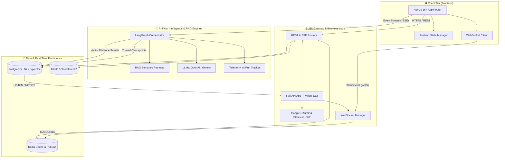
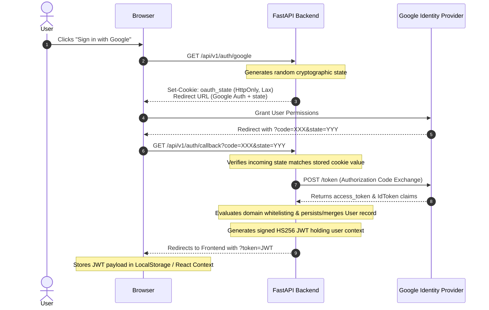
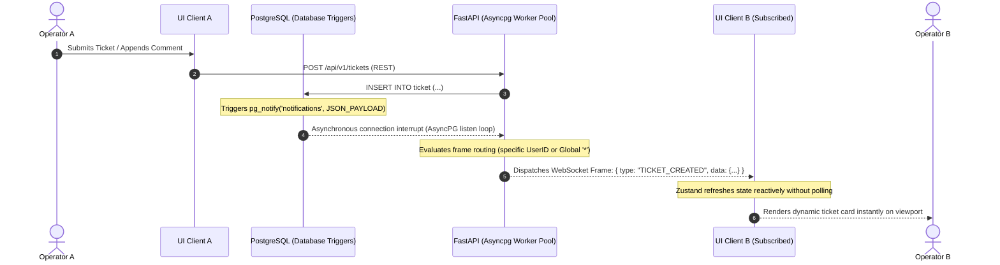
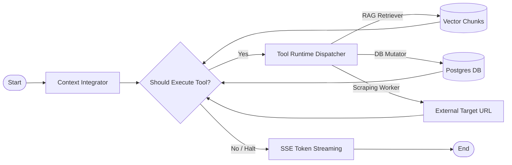

# 🏛️ System Architecture: Ticket AI (D4-Ticket AI)

This document provides an exhaustive technical overview of the software architecture, transactional pipelines, and distributed workflows designed for the **D4-Ticket AI** graduation project. It outlines the decoupled integration between the Frontend ecosystem (React/Next.js), the reactive API Gateway (FastAPI), and the underlying Artificial Intelligence & Persistence layers.

---

## 📊 1. High-Level Topology (C4 System Context)

The following architecture diagram illustrates the runtime deployment topology and functional boundaries:



---

## 🔐 2. Authentication Pipeline (Stateless Google OAuth 2.0)

The system implements an industrialized 3-legged OAuth 2.0 authorization grant flow. It leverages cryptographically signed `HttpOnly` cookies for state validation to mitigate Cross-Site Request Forgery (CSRF) threat vectors.



---

## ⚡ 3. Real-Time Communication Layer (Reactive WebSockets)

To achieve zero-latency updates across multiple concurrent operators (e.g., rendering live ticket cards instantly inside the Kanban view), the platform implements an event-driven Publish/Subscribe pattern bound to **PostgreSQL LISTEN/NOTIFY**.



---

## 🧠 4. Intelligent Co-Pilot: Hybrid RAG & Agentic Workflows

The core AI engine assists operators in troubleshooting complex tickets by combining precise lexical retrieval with vector-based conceptual semantics.

### Retrieval Engine: Hybrid Search via Reciprocal Rank Fusion (RRF)
Raw vector similarity searches often fail on exact names, configuration flags, or system port numbers. To guarantee robust recall, the backend orchestrates:
1.  **Semantic Vector Search**: Embeds incoming user queries via external vectorizers and computes cosine distance inside `pgvector`.
2.  **Lexical Search (BM25/Full-Text)**: Executes traditional, weighted full-text index lookups inside Postgres.
3.  **Reciprocal Rank Fusion**: Consumes both ranked lists and applies a weighted Reciprocal Rank Fusion equation to provide an industrialized, highly accurate fused set of document chunks.

### Cyclic State Graph (LangGraph Orchestration)
Rather than employing a basic, sequential text-completion interface, the chat co-pilot is modeled as a **Cyclic Stateful Action-Selection Graph**:



### Telemetry & Economic Modeling
Every operational runtime trace is logged inside the database via a unified `AIRunTracker` module:
*   Aggregates actual input/output token counters on terminal connection closures.
*   Applies specific cost-per-million metrics to estimate the absolute USD transaction cost for each LLM invocation.
*   Pairs runtime stats with end-user `AIFeedback` payloads for offline evaluation and prompt engineering cycles.

---

## 📁 5. Project Directory Layout (Professional Monorepo)

```text
📂 DAW-PROYECTO-FINAL
├── 📂 backend/                  # FastAPI Enterprise Clean Architecture (Hexagonal-Lite)
│   ├── 📂 app/
│   │   ├── 📂 ai/               # Agentic Workflows, LangGraph Checkpointers, & Observability
│   │   ├── 📂 api/              # API Gateway controllers (REST, SSE, WebSockets)
│   │   ├── 📂 core/             # JWT Security, PydanticSettings Config, & WebSocketManager
│   │   ├── 📂 db/               # Asynchronous SQLAlchemy Engine & Session Factories
│   │   ├── 📂 models/           # Declarative Domain Models (SQLAlchemy Mappings)
│   │   ├── 📂 schemas/          # Typed Input/Output Data Transfer Objects (Pydantic)
│   │   └── 📂 services/         # Domain Logic Modules (Cache, RAG, Scrapers, Notifications)
│   └── 📂 tests/                # Integration Pytest Suite (212 test cases, Zero Regressions)
│
└── 📂 frontend/                 # Next.js Enterprise Component Topology
    ├── 📂 e2e/                  # Playwright End-to-End Browser Test Specs
    └── 📂 src/
        ├── 📂 app/              # App Router Hierarchy (Pages, Dynamic Slugs, Global Layouts)
        ├── 📂 components/       # Atomized React UI Modules (Kanban Board, AI Lateral Drawers)
        ├── 📂 hooks/            # Stateful Enterprise Custom Hooks (useAuth, useWS)
        ├── 📂 lib/              # External Clients (Axios Singleton Instance) & Utility Helpers
        └── 📂 store/            # Zustand State Slices (Global Responsive UI Synchronization)
```
