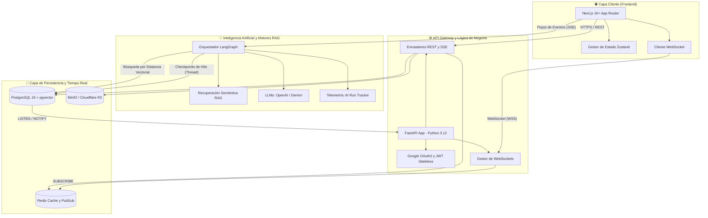
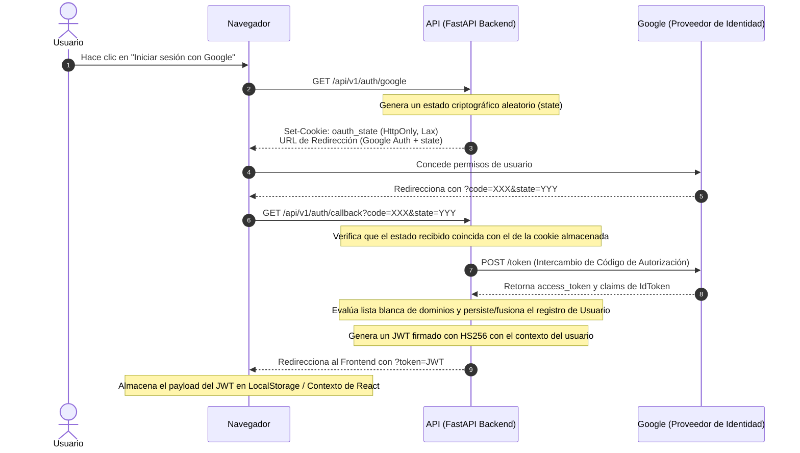
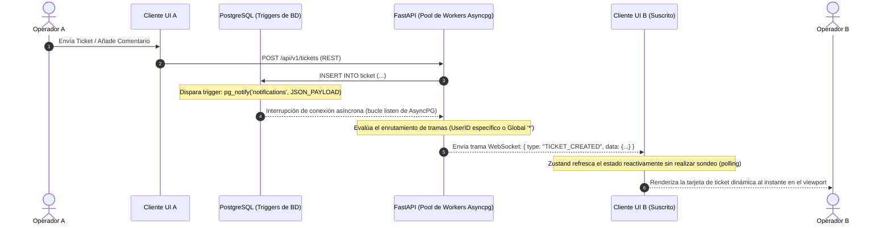
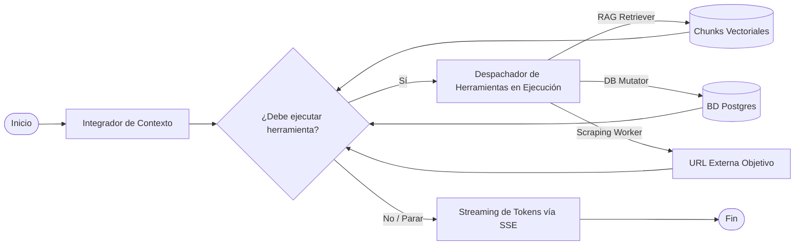

# 🏛️ Arquitectura del Sistema: Ticket AI (D4-Ticket AI)

Este documento proporciona una descripción técnica exhaustiva de la arquitectura de software, los flujos transaccionales y los flujos de trabajo distribuidos diseñados para el proyecto final de grado **D4-Ticket AI**. Detalla la integración desacoplada entre el ecosistema Frontend (React/Next.js), el API Gateway reactivo (FastAPI) y las capas subyacentes de Inteligencia Artificial y Persistencia.

---

## 📊 1. Topología de Alto Nivel (Contexto de Sistema C4)

El siguiente diagrama de arquitectura ilustra la topología de despliegue en tiempo de ejecución y los límites funcionales del sistema:



---

## 🔐 2. Pipeline de Autenticación (Google OAuth 2.0 Stateless)

El sistema implementa un flujo industrializado de autorización OAuth 2.0 de tres pasos (*3-legged OAuth*). Utiliza cookies con firma criptográfica y la directiva `HttpOnly` para la validación del parámetro de estado (`state`), mitigando de forma nativa los vectores de ataque de tipo Falsificación de Petición en Sitios Cruzados (CSRF).



---

## ⚡ 3. Capa de Comunicación en Tiempo Real (WebSockets Reactivos)

Para lograr actualizaciones con latencia cero entre múltiples operadores concurrentes (por ejemplo, renderizar tarjetas de tickets en tiempo real al instante dentro de la vista Kanban), la plataforma implementa un patrón de Publicación/Suscripción (*Publish/Subscribe*) dirigido por eventos y vinculado al mecanismo **PostgreSQL LISTEN/NOTIFY**.



---

## 🧠 4. Copiloto Inteligente: RAG Híbrido y Flujos Agénticos

El motor de IA principal asiste a los operadores en la resolución de problemas de tickets complejos combinando una recuperación léxica precisa con semántica conceptual basada en vectores.

### Motor de Recuperación: Búsqueda Híbrida mediante Reciprocal Rank Fusion (RRF)
Las búsquedas por similitud vectorial pura a menudo fallan con nombres exactos, banderas (*flags*) de configuración o números de puerto del sistema. Para garantizar una recuperación (*recall*) robusta, el backend orquesta:
1.  **Búsqueda Vectorial Semántica**: Genera los embeddings de las consultas de los usuarios mediante vectorizadores externos y calcula la distancia coseno dentro de `pgvector`.
2.  **Búsqueda Léxica (BM25/Full-Text)**: Ejecuta búsquedas tradicionales ponderadas sobre índices de texto completo (*Full-Text*) en PostgreSQL.
3.  **Reciprocal Rank Fusion (RRF)**: Consume ambas listas clasificadas y aplica una ecuación matemática RRF ponderada para proporcionar un conjunto fusionado de fragmentos (*chunks*) de documentos altamente preciso e industrializado.

### Grafo de Estado Cíclico (Orquestación con LangGraph)
En lugar de emplear una interfaz de completado de texto básica y secuencial, el copiloto de chat está modelado como un **Grafo Cíclico de Selección de Acciones con Estado (*Cyclic Stateful Action-Selection Graph*)**:



### Telemetría y Modelado Económico
Cada traza de ejecución en tiempo de ejecución se registra en la base de datos a través de un módulo unificado `AIRunTracker`:
*   Agrupa contadores de tokens reales de entrada/salida (*input/output*) en el cierre de la conexión.
*   Aplica métricas específicas de coste por millón para estimar el coste de transacción absoluto en USD para cada invocación de LLM.
*   Empareja las estadísticas de tiempo de ejecución con las respuestas de feedback de los usuarios finales (`AIFeedback`) para su posterior evaluación offline y ciclos de ingeniería de prompts (*prompt engineering*).

---

## 📁 5. Estructura de Directorios del Proyecto (Monorepo Profesional)

```text
📂 DAW-PROYECTO-FINAL
├── 📂 backend/                  # Arquitectura Limpia Enterprise con FastAPI (Hexagonal-Lite)
│   ├── 📂 app/
│   │   ├── 📂 ai/               # Flujos Agénticos, Checkpointers de LangGraph y Observabilidad
│   │   ├── 📂 api/              # Controladores del API Gateway (REST, SSE, WebSockets)
│   │   ├── 📂 core/             # Seguridad JWT, Configuración PydanticSettings y WebSocketManager
│   │   ├── 📂 db/               # Motor de SQLAlchemy Asíncrono y Factorías de Sesión
│   │   ├── 📂 models/           # Modelos de Dominio Declarativos (Mapeos de SQLAlchemy)
│   │   ├── 📂 schemas/          # Objetos de Transferencia de Datos (DTO) Tipados Entrada/Salida (Pydantic)
│   │   └── 📂 services/         # Módulos de Lógica de Dominio (Caché, RAG, Scrapers, Notificaciones)
│   └── 📂 tests/                # Suite de Pruebas de Integración con Pytest (212 casos, Cero Regresiones)
│
└── 📂 frontend/                 # Topología de Componentes Next.js Enterprise
    ├── 📂 e2e/                  # Especificaciones de Pruebas de Navegador End-to-End con Playwright
    └── 📂 src/
        ├── 📂 app/              # Jerarquía de App Router (Páginas, Slugs Dinámicos, Layouts Globales)
        ├── 📂 components/       # Módulos de UI de React Atomizados (Tablero Kanban, Cajones Laterales de IA)
        ├── 📂 hooks/            # Hooks Personalizados Enterprise con Estado (useAuth, useWS)
        ├── 📂 lib/              # Clientes Externos (Instancia Singleton de Axios) y Helpers de Utilidad
        └── 📂 store/            # Slices de Estado de Zustand (Sincronización Global de UI Responsiva)
```
